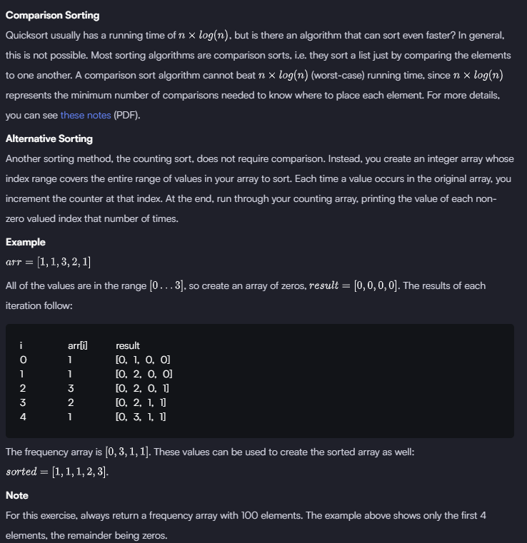
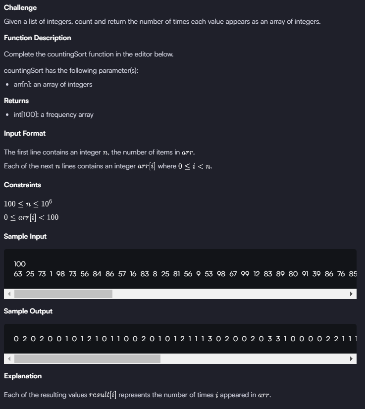

# Counting Sort 1

For this exercise, we have a constraint that all numbers in arr[i] will be between 0 inclusive and 100 exclusive.  
Therefore, the first thing to do is create enough space for the frequency array. Once you got that, you just have to start  
counting the times each number appears and assigning them to the appropiate index as per the instructions.
i.e: If a number in the original list is 98, and its the first time we see that number, we will asign it to frequencyArr[98] = 1.  
For each the we see another 98, we'll sum +1 on that same index. That way, we'll get the frequency array.  

Now, if we wanted to use that frequency array to sort the list, we would just have to iterate through the array and lets say we find this:
frequencyArr[1] = 3. Then we iterate 3 times a list and add first 3 ones. (1,1,1), because by asigning each number to an index, we already have all numbers ordered, we just have to convert their count into a separate number each.