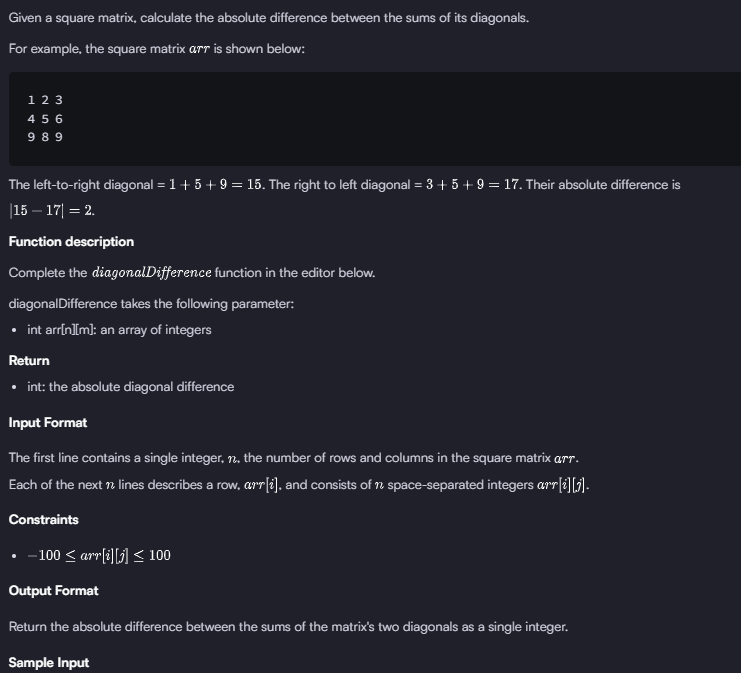
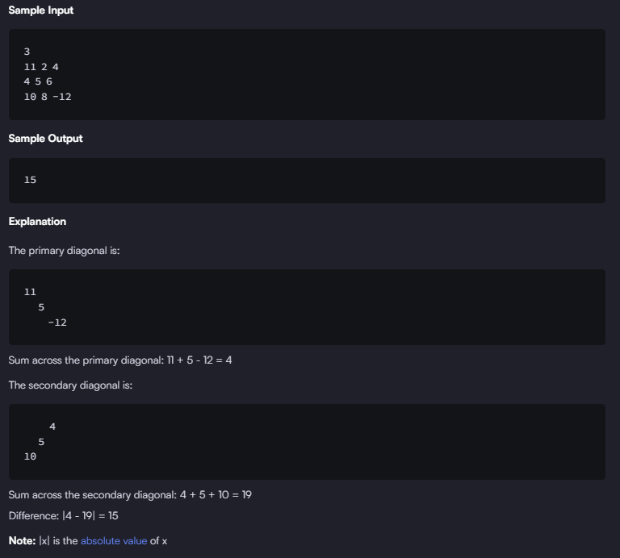

# Diagonal Diference Exercise



For this exercise, I cam with an approach of two for loops. The first one iterates over the rows and the second one over the columns.  
We can see that all of the matrixes are mxm, therefore, they are perfectly squared. So every i == j, is the main diagonal  
And we can also see a pattern for the secondary diagonal as follows:
```
1. i = 0, j = m - 1
2. i = 1, j = m - 2
3. i = 2, j = m - 3  
and so on...  
Another way to see this pattern is the next one:
1. i = 0, j = (m - 1) - i
2. i = 1, j = (m - 1) - i
3. i = 2, j = (m - 1) - i
```  
Based on that pattern, we can get the sums of both the main diagonal and the secondary diagonal.