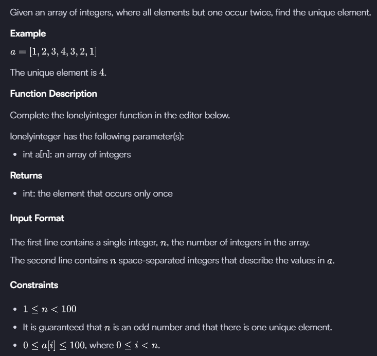

# Lonely Integer Problem

For this problem I can initially think of two ways of solving it.
- Using a dictionary type of object so that I can check the number of times a specific number has appeared
- Using two pointers so that one pointer iterates through the array and checks how many times a specific element appears.

## 1st Solution: Dictionary
The idea is to have a dictionary that will sum each ocurrence of each number. Then, at the end, we'll use  stream to get the number that its value is only one and return it.
## 2nd Solution: Two pointers
We will have two pointers that will go through the list. The moment we go through the whole list, if the counter is still 1, then that'll be the solution as there is just 1 number with 1 occurence.